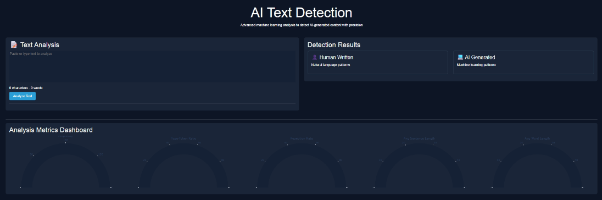
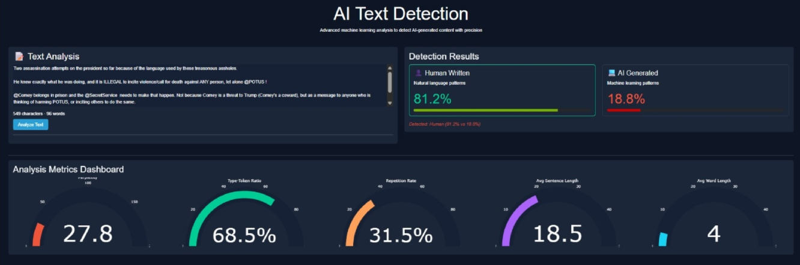

# AI-Text Detection App

A friendly and intelligent web app that lets you paste or type any piece of text and instantly reveals whether it was likely written by a **human** or generated by **AI**.

The dashboard gives you a clear and interactive view:

✅ A progress bar and gauge showing how confident the system is in its prediction  

✅ Five smart writing stats that help explain the result – like how fluent the text is (*perplexity*), how rich the vocabulary is (*type-token ratio*), how much repetition there is, and how long the sentences and words tend to be.

It's like a lie detector for language – made simple, fast, and visual.

---

## Dashboard Preview

### Before Analysis

### After Analysis (Elon Musk Tweet Example)

---

## Table of Contents

1. [Features](#features)
2. [Installation](#installation)
3. [Uncompressing Model Files](#uncompressing-model-files)
4. [Usage](#usage)
5. [Project Structure](#project-structure)
6. [How It Works](#how-it-works)
7. [Model Decision Logic](#model-decision-logic)  
8. [Roadmap](#roadmap-)  
9. [Contributing](#contributing)  
10. [License](#license)
  
---

## Features
- **Text Classification:** Predicts whether input text is human-written or AI-generated with confidence scores.  
- **Interactive Dashboard:** Visualizes results using  
    • Progress bars for human and AI probabilities  
    • Gauge charts for key metrics (Perplexity, Type-Token Ratio, Repetition Rate, Avg Sentence Length, Avg Word Length)  
- **Real-Time Analysis:** Updates character and word counts as you type.  
- **Dark Theme:** Sleek, cyberpunk-inspired UI using Dash Bootstrap Components (CYBORG).  
- **Extensible:** Modular feature-extraction pipeline for adding new linguistic or model-based features.  

---

## Installation

### Prerequisites
- Python 3.8 or higher  
- Git  
- Pre-trained XGBoost model files (`best_model_xgboost.joblib.xz` or `xgboost_model.json.xz`) in `model/`

### Steps
1. **Clone the repository**
    
        git clone https://github.com/yourusername/ai-text-detection.git
        cd ai-text-detection
    
2. **Create a virtual environment**
    
        python -m venv venv
        source venv/bin/activate      # On Windows: venv\Scripts\activate
    
3. **Install dependencies**
    
        pip install -r requirements.txt
    
4. **Verify compressed model files**  
   Confirm these exist inside `model/`:
    
        model/best_model_xgboost.joblib.xz
        model/xgboost_model.json.xz
        model/decompress_xz_file.py

> [!NOTE]
> Running BERT and GPT-2 locally is resource-intensive. A GPU is recommended, but CPU fallback is supported.

---

## Uncompressing Model Files
Inside the `model/` directory, run:

    cd model
    python decompress_xz_file.py best_model_xgboost.joblib.xz xgboost_model.json.xz

This produces:

    model/best_model_xgboost.joblib
    model/xgboost_model.json

**Troubleshooting notes**
- `lzma` is part of the Python standard library.  
- Ensure the `.xz` files are intact and you have write permissions.  

---

## Usage

1. **Run the application**

        python app.py
    
2. **Open the dashboard** – Once the app starts, the terminal will display a local address (e.g., http://...).

   Navigate to that address in your browser to open the dashboard.

4. **Analyze text**
   - Paste or type text into the text area.  
   - Click **Analyze Text**.  
   - Results show:  
        • Human & AI probability progress bars  
        • Gauge charts for Perplexity, TTR, Repetition Rate, Avg Sentence Length, Avg Word Length  
        • A confidence verdict message  

> [!IMPORTANT]
> The more text you give the app, the more accurate its answer will be. Longer passages contain more clues about writing style-like word choice, sentence structure, and repetition – so the model can make a surer decision.

## Project Structure

    ai-text-detection/
    ├── assets/
    │ ├── style.css
    │ ├── blank_dashboard.png
    │ └── elon_tweet_dashboard.png
    ├── model/
    │ ├── best_model_xgboost.joblib.xz
    │ ├── xgboost_model.json.xz
    │ ├── best_model_xgboost.joblib
    │ ├── xgboost_model.json
    │ └── decompress_xz_file.py
    ├── app.py
    ├── detection.py
    ├── embeddings.py
    ├── features.py
    ├── metrics.py
    ├── perplexity.py
    ├── requirements.txt
    └── README.md

## How It Works

### Feature Extraction
- **BERT embeddings** – 768-dimensional semantic vectors (`bert-base-uncased`).  
- **Linguistic features**  
    • *Statistical:* avg sentence/word length, punctuation ratio, uppercase ratio  
    • *Stylistic:* Type-Token Ratio, repetition rate, rare-word frequency, sentiment (VADER)  
    • *Syntactic:* POS ratios, dependency depth, passive-voice ratio  
    • *Meta:* Burstiness (variance / mean sentence length)  
- **Perplexity** – GPT-2 fluency; lower = more natural flow.

### Model Inference
- Concatenate features into a 1792-dimensional vector (zero-padded if needed).  
- XGBoost classifier outputs probabilities of human vs AI authorship.

### Visualization
- Progress bars for probabilities.  
- Gauge charts for five metrics.  
- Result card highlights dominant class (human/AI).

---

## Model Decision Logic

The model decides based on **a combination of deep and surface-level features**:

- **Deep Representation:** 768-dim BERT embedding captures high-level semantics.
- **Surface Linguistics:** Metrics like TTR, repetition rate, and burstiness reveal patterns often associated with AI or human writing.
- **GPT-2 Perplexity:** High perplexity suggests unfamiliar, unnatural phrasing (often human); low suggests fluency (often AI).
- All features are passed to an **XGBoost classifier** trained on a labeled dataset of AI- vs human-written text.

---

## Roadmap 📍

### Current Capabilities

- [x] BERT and GPT-2-based feature extraction  
- [x] Rich dashboard visualizations  
- [x] Modular detection logic  

### Planned Improvements

- [ ] **Model Compression** – Reduce memory with quantized or distilled models  
- [ ] **Model Upgrade** – Try LLMs like RoBERTa, DeBERTa, or GPT-Neo for embeddings  
- [ ] **Training Mode** – Allow uploading labeled examples to fine-tune or retrain the model  
- [ ] **Multilingual Support** – Extend feature pipeline for non-English texts  
- [ ] **Mobile Viewport Optimization** – Improve responsiveness on small screens

---

## Contributing

1. Fork → create branch → commit → push → PR.  
2. Follow PEP 8 and add tests.  

> [!NOTE]
> New features must update `analyze_text` in `detection.py` and keep the feature vector length at 1792.

---

## License
MIT License – see `LICENSE`.
